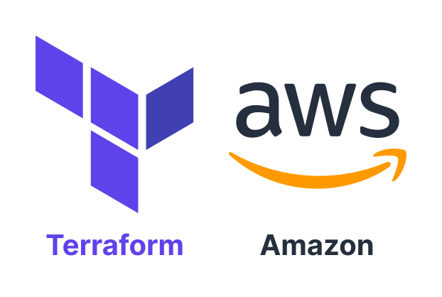

# Terraform Workspace Environments



This repository demonstrates a basic example of using Terraform Workspaces for efficiently managing environments in the
infrastructure as code (IaC) projects.

# 1. Need for Workspaces

- Let's say there's a scenario where we need an EC2 instance.
- Instead of creating an EC2 instance separately every time, we can pack it into a module and just reuse it.
- But what if we need to create an EC2 instance across multiple environments (dev, stage, prod)?
	- Within the modules folder, we can create multiple Terraform variable files such as:
		- `dev.tfvars`
		- `stage.tfvars`
		- `prod.tfvars`
	- However, the problem here is that all of these three files are going to use the same `.tfstate` file.
	- This means if you update `dev.tfvars` for example, it will update `.tfstate`, which will also trigger
		updating `stage.tfvars` and `prod.tfvars`, and thus update the same resources.
	- By using workspaces, we can maintain a separate state file for each of the workspaces.

## 1.1. Definition


- Workspaces separate work areas for your Terraform projects.
- Allows us to isolate and manage your infrastructure configurations, making it easier to handle multiple environments
	like development, testing and production.

## 1.2. Benefits

- **Isolation**
	- You can keep your configurations separate, reducing the risk of accidental changes affecting your production
		environment.
- **Efficiency**
	- Workspaces streamline the process of managing multiple environments with common codebases, which enhances code
		reusability.

## 1.3. When to Avoid Workspaces?

- Workspaces are not great for system decomposition or deployments requiring separate credentials and access controls.
- Most of the time, workspaces are useful when you have the same credentials.
	- For example, if you have a separate account for `dev`, another account for `stage`, and a third account for `prod`,
		you can't use workspaces.

# 2. Terraform Workspaces

1. List all existing workspaces:

```shell
terraform workspace list
```

2. Create a new workspace:

```shell
terraform workspace new dev
terraform workspace new stage
terraform workspace new prod
```

- List the workspaces again to verify they have been created.

3. Select a particular workspace:

```shell
terraform workspace select dev
```

4. To check what is the currently selected workspace, use command:

```shell
terraform workspace show
```

5. Once the `dev` workspace is selected, apply the `dev.tfvars`:

```shell
terraform apply --var-file="dev.tfvars" --auto-approve
```

- Repeat the similar process for other workspace environments.
- This should now create different EC2 instances instead of updating the same instance.
